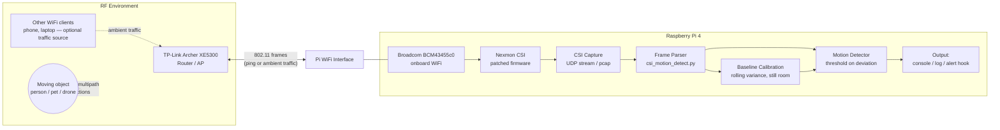

# Architecture — WiFi CSI Motion Sensing System

## 1. Overview

The system turns a Raspberry Pi 4's onboard WiFi radio into a passive CSI sensor, using an existing WiFi link (Pi ↔ TP-Link Archer XE5300, or Pi ↔ ambient traffic) as the sensing medium. No dedicated sensor hardware, camera, or router-side support is required — all sensing logic runs on the Pi.

## 2. System diagram

## 3. Components

### 3.1 RF sensing medium
The WiFi link between the Pi and the router (or any ambient traffic between the router and other clients) is the sensing substrate. Every frame's radio path is shaped by the physical environment — walls, furniture, and anything moving through it. This is not a purpose-built signal; it's ordinary WiFi traffic repurposed as a sensor.

### 3.2 Nexmon CSI (firmware layer)
A patched Broadcom firmware image loaded onto the Pi 4's onboard chip. It exposes per-subcarrier Channel State Information (amplitude + phase, one value pair per OFDM subcarrier) for every frame the radio processes — data the stock firmware discards after computing net signal quality. This is the layer that makes fine-grained sensing possible from consumer WiFi hardware.

### 3.3 Capture layer
CSI frames stream off the Pi either as:
- **Live UDP** — Nexmon's extractor pushes frames to a local UDP port as they arrive, or
- **pcap** — captured to disk (e.g. via `tcpdump`) for offline analysis and threshold tuning.

### 3.4 Parsing (`csi_motion_detect.py`)
Strips Nexmon's frame header and unpacks the interleaved real/imaginary subcarrier values into a per-frame amplitude vector. Header length and subcarrier count are build-specific (depend on channel bandwidth configured in Nexmon's `make.sh`) and must match your firmware build.

### 3.5 Calibration
On startup, the detector collects a configurable number of frames (default 100) with the environment still, and computes the mean/standard deviation of per-frame subcarrier variance. This baseline is what live readings are compared against — it implicitly captures the static multipath signature of the specific room/furniture layout, which is why calibration needs to be redone if the environment changes significantly.

### 3.6 Detection
For each new frame: compute variance across subcarriers, smooth over a rolling window, and compare the smoothed value against the calibrated baseline in standard-deviation units. Crossing the threshold flags motion.

### 3.7 Output
Currently console logging; designed as a hook point for downstream alerting (MQTT publish, webhook, push notification) without changing the detection core.

## 4. Data flow summary

1. Router and Pi (or Pi and another client) exchange ordinary 802.11 frames.
2. Nexmon-patched firmware extracts CSI for each received frame.
3. CSI streams to the parser as UDP packets or pcap records.
4. Parser converts raw bytes → per-subcarrier amplitude vector.
5. Detector compares live variance to calibrated baseline.
6. Motion events are emitted for downstream consumption.

## 5. Deployment topology notes

- **Single-Pi, single-router**: simplest setup — Pi pings the router continuously to guarantee a steady CSI stream. Works well for single-room coverage.
- **Passive/ambient mode**: Pi sniffs existing traffic between the router and other devices (no ping needed) if there's already regular traffic (streaming, calls). Lower Pi overhead, less predictable frame rate.
- **Network access while sensing**: the onboard radio can't simultaneously serve as a normal WiFi client and run in Nexmon's monitor/CSI mode. If the Pi needs its own network connection while sensing, add a second USB WiFi adapter for uplink, or route logs over Ethernet.

## 6. Extension points (see white paper §5 for detail)

- **Spectral/micro-Doppler analysis**: replacing simple variance thresholding with frequency-domain analysis of the CSI time series to distinguish motion *types* (human gait vs. rotor-induced vibration), a prerequisite for any drone-classification capability at close range.
- **Multi-node fusion**: multiple Pi sensors around a space could triangulate rough position, not just binary motion.
- **SDR-based RF sniffer**: a separate, non-CSI subsystem for outdoor-range drone detection via control/video-link RF signatures — a different sensing modality sharing the Pi as compute, not part of the CSI pipeline itself.
